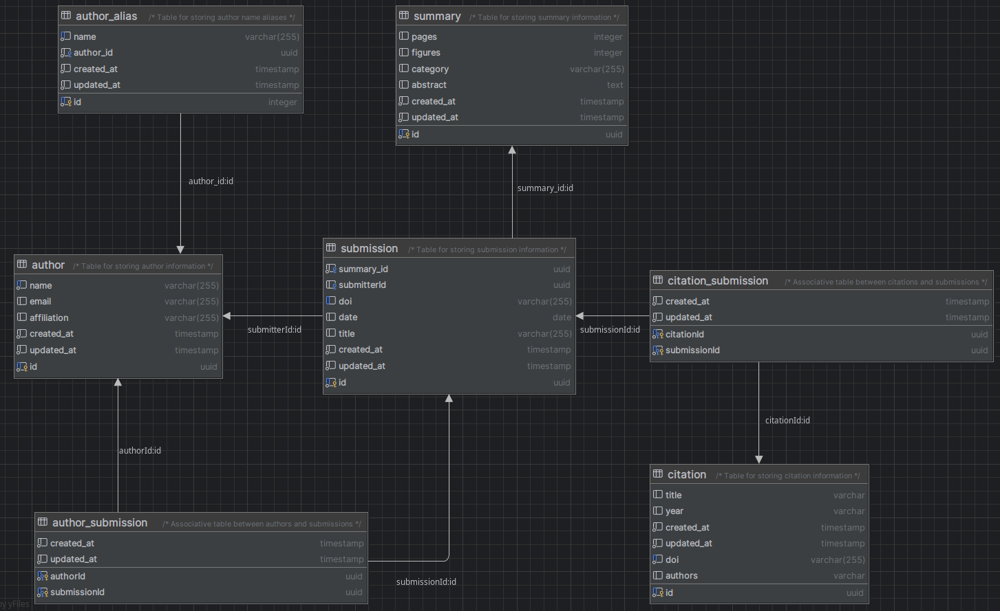

## Setup

Refere to [airflow docker compose docs](https://airflow.apache.org/docs/apache-airflow/stable/howto/docker-compose/index.html) for more information

### Initial setup

This will create all the necessary folders, initialize airflow containers and create postgres db with project schema.

1. Make a copy of .env.sample and rename it to .env. Make any overrides you need for compose there

    ```bash
    cp .env.sample .env
    ```

2. Create airflow folders

    ```bash
    mkdir -p ./airflow/dags ./airflow/logs ./airflow/plugins ./airflow/config ./airflow/data ./airflow/data/sql ./airflow/data/kaggle_data
    ```

3. Create airflow base image with project dependencies and connections

    ```bash
     docker build -t data-eng-project-airflow-base .
    ```

4. Initialize airflow

    ```bash
    docker compose up airflow-init
    ```
5. Run liquibase update. Execute from project root directory

    ```bash
     ./liquibase/update.sh
    ```

6. Install python 3.11 dependencies (recommended to use a virtual environment) for development
    ```bash
    pip install -r requirements.txt
    ```

  * Optional but recommended to use virtualenv(MacOS)
    ```bash
    homebrew install virtualenv
    virtualenv -p python3.11 data_eng_project
    source data_eng_project/bin/activate
    python --version #Check that the virtual env is using 3.11.x
    pip install -r requirements.txt
    #When done working in virtual env, exit virtual env: deactivate
    ```

### Running locally

Run docker compose

```bash
docker compose up -d
```

Airflow web UI will be available at http://localhost:8080 with default credentials username: airflow, password: airflow.
Postgres connection will be available on host at localhost:5444/dwh_pg with default credentials username: dwh_user, password: dwh_user.

To stop everything

```bash
docker compose stop
```

To clean project schema

```bash
./liquibase/dropProject.sh
```

To clean up everything

```bash
docker compose down --volumes --remove-orphans
```

## DW schema

Current schema

.


## Initial thoughts

### Fact

#### Submission
* id
* versionId (FK version)
* summaryId (FK summary)
* submitterId (FK author)
* paperId
* date
* title

### Dimensions

#### Version
* id
* number
* creationDate

#### Author
* id
* name
* email
* affiliation

#### Author to submission
* authorId (FK author)
* submissionId (FK submission)

#### Citation
* id
* title
* year
* publisher

#### Citation to submission
* citationId (FK citation)
* submissionId (FK submission)

#### Author to citation
* authorId (FK author)
* citationId (FK citation)

#### Summary
* id
* pages
* figures
* category
* abstract


### Graph

#### Paper
* id
* title

#### Author
* name
* email

#### Authored Author -> Paper 
* date

#### Submitted Author -> Paper
* date

